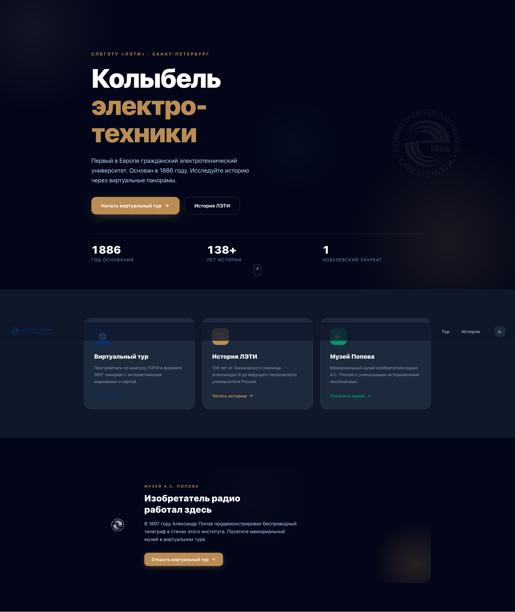
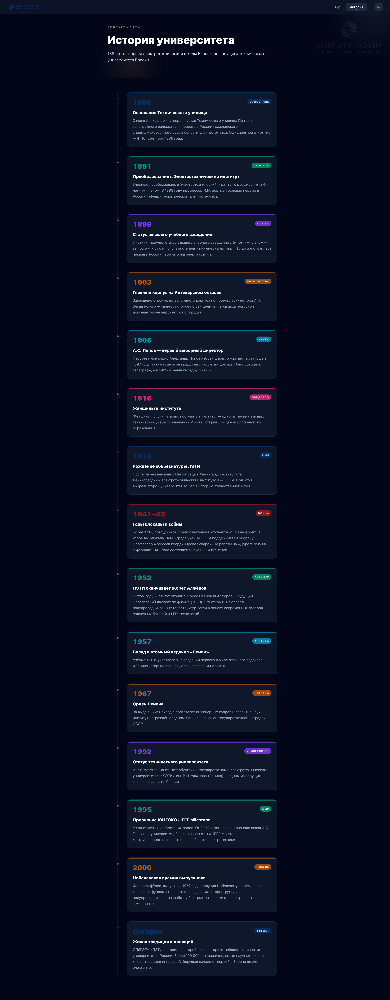
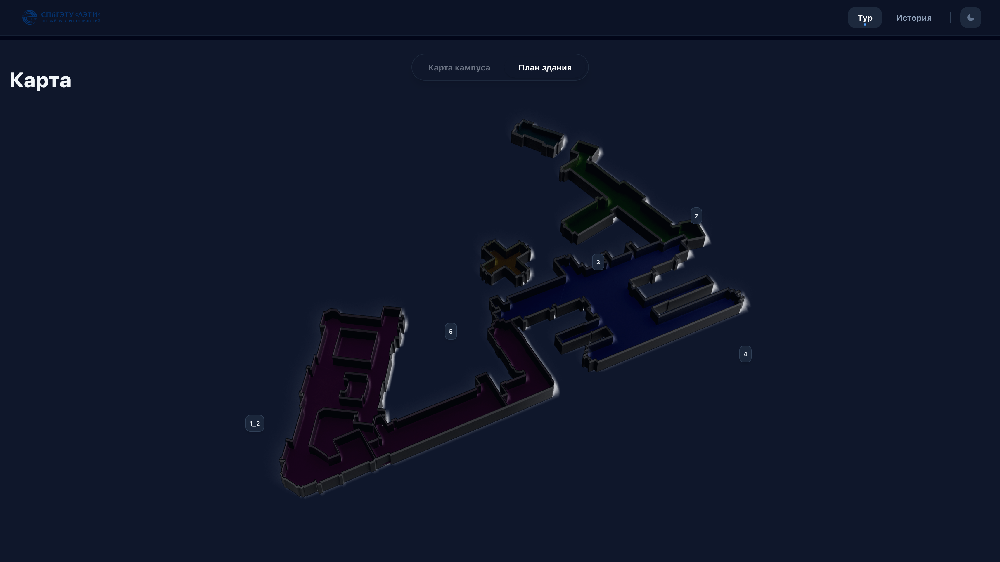
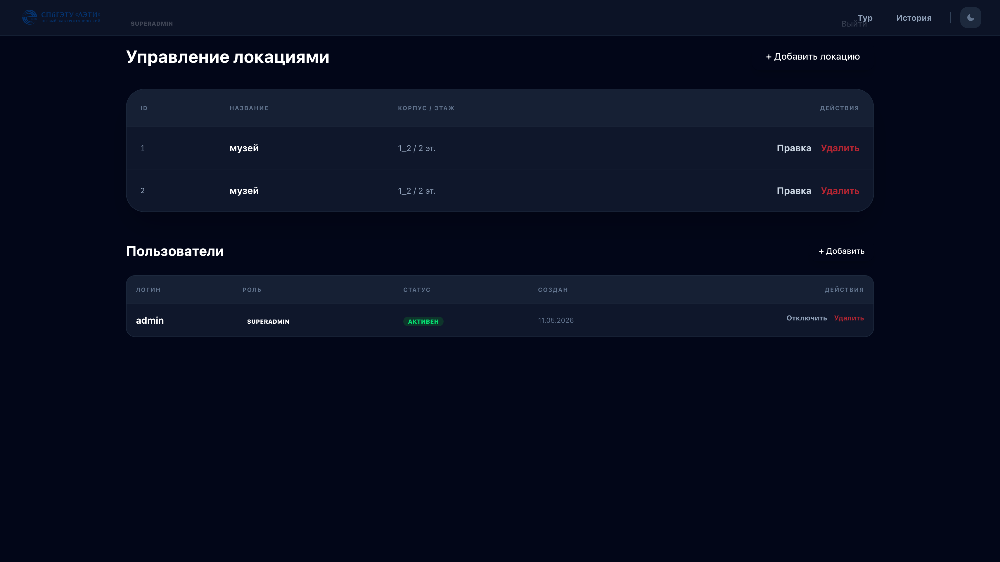
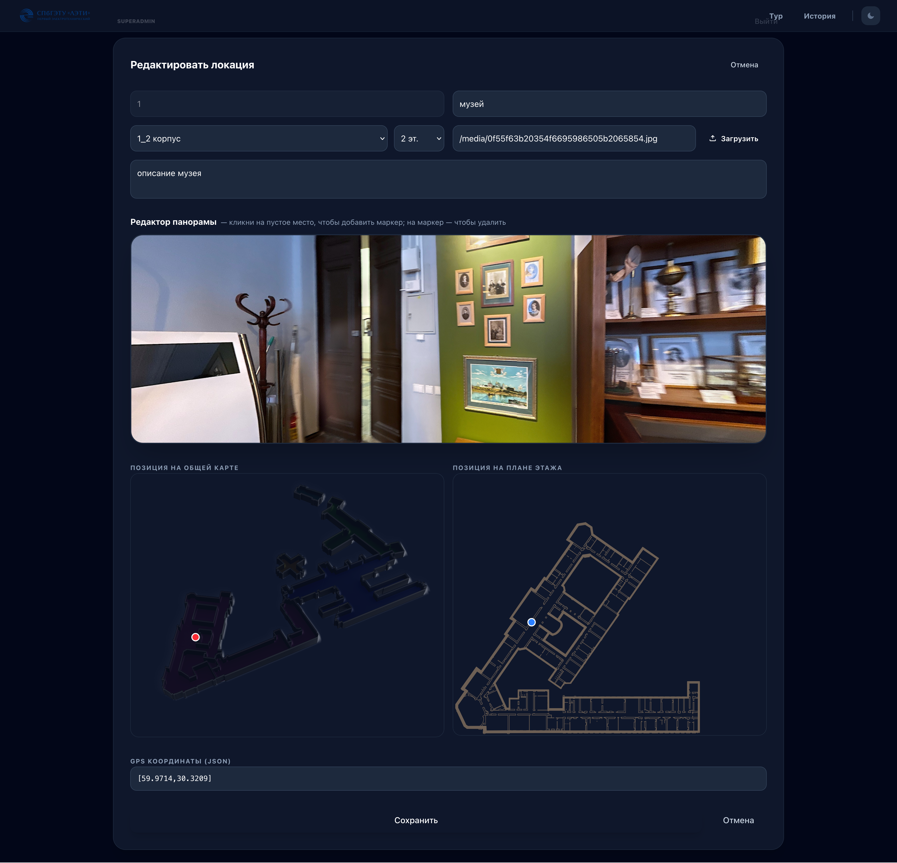

<div align="center">


# LETI Virtual Tour

**Интерактивный виртуальный тур по кампусу ЛЭТИ**  
*(Санкт-Петербургский государственный электротехнический университет «ЛЭТИ»)*

[](https://fastapi.tiangolo.com)
[](https://reactjs.org)
[](https://www.typescriptlang.org)
[](https://www.postgresql.org)
[](https://www.docker.com)
[](LICENSE)

[🌐 Демо](#) · [📖 Документация](#архитектура) · [🐛 Баги](../../issues) · [💡 Предложения](../../issues)

</div>

---

## ✨ О проекте

**LETI Tour** — это веб-приложение для виртуального знакомства с кампусом ЛЭТИ. Пользователи могут перемещаться по интерактивной карте кампуса, заходить в здания и исследовать помещения через 360° панорамы.

### Что умеет приложение

| Функция | Описание |
|--------|----------|
| 🗺️ **Карта кампуса** | Leaflet-карта с маркерами всех корпусов университета |
| 🏛️ **Планы этажей** | Интерактивные схемы внутри зданий |
| 🔭 **360° панорамы** | Иммерсивный просмотр помещений через Photo Sphere Viewer |
| 📌 **Точки интереса** | Интерактивные маркеры с описанием и переходами между локациями |
| 🌓 **Тёмная тема** | Переключение светлой/тёмной темы |
| 🔐 **Админ-панель** | Управление локациями, фото и пользователями |
| 🔄 **JWT-аутентификация** | Access + Refresh токены с ротацией через Redis |

---

## 🖥️ Скриншоты

<table>
  <tr>
    <td align="center"><b>Главная страница</b></td>
    <td align="center"><b>Страница истории</b></td>
  </tr>
  <tr>
    <td></td>
    <td></td>
  </tr>
  <tr>
    <td align="center"><b>Карта кампуса</b></td>
    <td align="center"><b>360° Панорама</b></td>
  </tr>
  <tr>
    <td></td>
    <td></td>
  </tr>
  <tr>
    <td align="center"><b>Схема здания</b></td>
    <td align="center"><b>Админ-панель</b></td>
  </tr>
  <tr>
    <td></td>
    <td></td>
    <td></td>
  </tr>
</table>

---

## 🚀 Быстрый старт

### Предварительные требования

- [Docker](https://www.docker.com/get-started) & Docker Compose
- [Git](https://git-scm.com)

### Запуск одной командой

```bash
git clone https://github.com/slon-hk/LETI_TOUR.git
cd leti-tour
cp .env.example .env          # Заполните переменные окружения
docker compose up --build
```

Приложение будет доступно по адресу **http://localhost**

---

## ⚙️ Конфигурация

Скопируйте `.env.example` в `.env` и заполните следующие переменные:

```env
# База данных
POSTGRES_PASSWORD=your_secure_password

# JWT
SECRET_KEY=<openssl rand -hex 32>
ACCESS_TOKEN_EXPIRE_MINUTES=15
REFRESH_TOKEN_EXPIRE_DAYS=7

# Superadmin (создаётся автоматически при первом запуске)
SUPERADMIN_EMAIL=admin@example.com
SUPERADMIN_PASSWORD=your_password

# Redis
REDIS_URL=redis://redis:6379/0
```

---

## 🏗️ Архитектура

```
leti-tour/
├── backend/                 # FastAPI приложение
│   ├── app/
│   │   ├── core/            # Конфиг, JWT, зависимости
│   │   ├── db/              # SQLAlchemy async сессии
│   │   ├── models/          # ORM модели (User, Location)
│   │   ├── schemas/         # Pydantic схемы
│   │   ├── routers/         # REST API роуты
│   │   └── services/        # Redis кэш, загрузка файлов
│   └── alembic/             # Миграции БД
│
├── frontend/gg/             # React приложение
│   └── src/
│       ├── api/             # Axios клиент с авто-рефрешем токена
│       ├── components/      # UI компоненты
│       │   ├── map/         # CampusMap, IndoorMap, Minimap
│       │   ├── tour/        # TourViewer (PSV + Three.js)
│       │   └── ui/          # Переиспользуемые компоненты
│       ├── hooks/           # TanStack Query хуки
│       ├── pages/           # Home, TourPage, HistoryPage, AdminPage
│       └── store/           # Zustand глобальный стейт
│
└── docker-compose.yml       # Postgres + Redis + Backend + Frontend + Certbot
```

### Стек технологий

<table>
<tr>
<td valign="top" width="50%">

**Backend**
- 🐍 **FastAPI** — async REST API
- 🗃️ **PostgreSQL 16** + SQLAlchemy (asyncpg)
- 🔴 **Redis 7** — хранение refresh-токенов
- 🔑 **JWT** — access (15 мин) + refresh (7 дней)
- 📦 **Alembic** — миграции схемы БД
- 🛡️ **RBAC** — роли `superadmin` / `editor`
- 🐳 **Docker** + Nginx + Certbot (SSL)

</td>
<td valign="top" width="50%">

**Frontend**
- ⚛️ **React 19** + TypeScript 5.8
- ⚡ **Vite** + Tailwind CSS v4
- 🗺️ **Leaflet** + React-Leaflet — карты
- 🔭 **Photo Sphere Viewer** — 360° просмотр
- 🎡 **Three.js** — рендеринг панорам
- 📡 **TanStack Query** — серверный стейт
- 🐻 **Zustand** — клиентский стейт

</td>
</tr>
</table>

---

## 🔌 API

Swagger UI доступен по адресу `/api/docs` в режиме разработки.

| Метод | Эндпоинт | Описание |
|-------|----------|----------|
| `POST` | `/api/auth/login` | Вход, получение токенов |
| `POST` | `/api/auth/refresh` | Обновление access-токена |
| `POST` | `/api/auth/logout` | Выход, отзыв токена |
| `GET` | `/api/locations` | Список всех локаций |
| `POST` | `/api/locations` | Создать локацию *(editor+)* |
| `PUT` | `/api/locations/{id}` | Обновить локацию *(editor+)* |
| `DELETE` | `/api/locations/{id}` | Удалить локацию *(editor+)* |
| `GET` | `/api/users` | Список пользователей *(superadmin)* |
| `POST` | `/api/uploads` | Загрузить медиафайл *(editor+)* |

---

## 🛠️ Разработка

**Backend (с горячей перезагрузкой):**
```bash
cd backend
uvicorn app.main:app --reload --port 8000
```

**Frontend (Vite dev server):**
```bash
cd frontend/gg
npm install
npm run dev        # http://localhost:5173
```

**Миграции БД:**
```bash
cd backend
alembic revision --autogenerate -m "describe change"
alembic upgrade head
```

**Линтинг и тайп-чек:**
```bash
cd frontend/gg
npm run lint
npx tsc --noEmit
```

---

## 🌐 Деплой

Приложение развёрнуто на **Azure VM** (Sweden Central).

```bash
ssh azureuser@<server-ip>
cd ~/gg && git pull && docker compose up --build -d
```

SSL-сертификаты автоматически обновляются контейнером **Certbot** каждые 12 часов.

---

## 📁 Маршруты приложения

| Путь | Страница |
|------|----------|
| `/` | Главная страница |
| `/tour` | Виртуальный тур (карта + панорама) |
| `/history` | История ЛЭТИ |
| `/admin` | Панель администратора *(защищена)* |

---

## 🤝 Вклад в проект

1. Форкните репозиторий
2. Создайте ветку фичи: `git checkout -b feature/amazing-feature`
3. Сделайте коммит: `git commit -m 'Add amazing feature'`
4. Запушьте: `git push origin feature/amazing-feature`
5. Откройте Pull Request

---

## 📄 Лицензия

Распространяется под лицензией MIT. Подробности в файле [LICENSE](LICENSE).

---

<div align="center">

Сделано с ❤️ для ЛЭТИ

</div>
